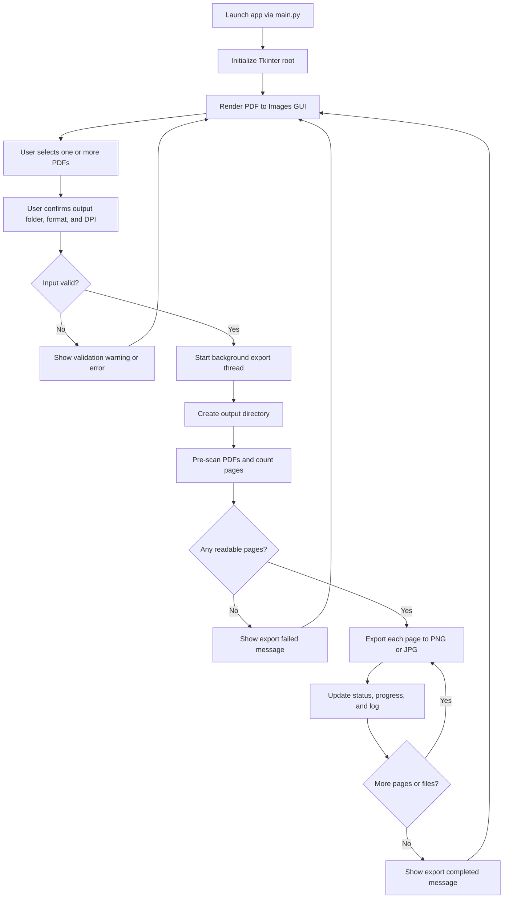

# PDF to Images GUI Converter

A modular Python desktop application that converts every page of one or more PDF files into image files using a simple Tkinter interface.


## Project Description

This project is a desktop utility for batch-converting PDF pages into images (`.png` or `.jpg`). Users can select multiple PDFs, choose an output folder, choose format and DPI, and export all pages with progress and logging feedback.

The codebase is intentionally split into modules to keep responsibilities clear:

- `main.py` is the single application entry point.
- `modules/pdf_to_images/application.py` bootstraps Tkinter.
- `modules/pdf_to_images/gui.py` contains the UI and user-flow orchestration.
- `modules/pdf_to_images/service.py` contains conversion and file-output logic.
- `modules/pdf_to_images/models.py` contains shared data models.

### Why these technologies were chosen

- **Tkinter**: Included with Python, lightweight, and sufficient for a desktop utility UI without external GUI frameworks.
- **PyMuPDF (`fitz`)**: Fast and reliable PDF rendering library for extracting pages as pixmaps.
- **Pillow**: Standard image processing/saving library that handles PNG/JPEG output cleanly.
- **Threading**: Keeps the UI responsive during long-running exports.

### Challenges solved by this implementation

- Preventing UI freezes during page conversion by running exports on a worker thread.
- Handling multiple PDFs while preserving per-file output organization.
- Avoiding output directory naming collisions through unique subfolder generation.
- Providing resilient defaults (e.g., default output folder) and user-friendly validation/errors.

## Installation

### Prerequisites

- Python 3.10+ (recommended)
- Windows, macOS, or Linux with Tk support in Python

### Setup steps

1. Clone or download this repository.
2. Open a terminal in the project root.
3. Create a virtual environment:

```bash
python -m venv .venv
```

4. Activate the virtual environment:

Windows (PowerShell):

```powershell
.\.venv\Scripts\Activate.ps1
```

macOS/Linux:

```bash
source .venv/bin/activate
```

5. Install dependencies:

```bash
pip install -r requirements.txt
```

### Required dependencies

- `PyMuPDF`
- `Pillow`

## Usage

Run the application:

```bash
python main.py
```

Backward-compatible alias:

```bash
python app.py
```

### How to use in the UI

1. Click **Add PDFs...** and select one or more PDF files.
2. Confirm or change the **Output folder** (defaults to `Downloads` when available).
3. Choose **Image format** (`png` or `jpg`).
4. Set **DPI** (default `300`; higher means larger/sharper images).
5. Click **Start Export**.
6. Check progress and logs in the application window.

## Program Flow (Activity Diagram)



## Contributing

Contributions are welcome.

1. Fork the repository.
2. Create a feature branch (`feature/your-change`).
3. Keep changes modular and consistent with existing structure.
4. Run validation checks from the **Tests** section.
5. Open a pull request with a clear summary and test notes.

## Tests

There is currently no formal unit/integration test suite in this repository.

For now, use these validation checks:

```bash
python -m compileall main.py app.py modules
```

Optional runtime smoke test:

```bash
python main.py
```

Future recommendation: add `pytest` and automate service-layer tests for conversion logic.

## Statement of AI Use

I use generative AI to accelerate my coding, but strictly maintain a "human in the loop" to ensure accountability and accuracy. Because AI is not a substitute for foundational programming knowledge and can produce confident errors (hallucinations), I actively apply my expertise to debug and refine all automated suggestions.

I am also highly vigilant against AI bias, recognizing that machine learning models can easily absorb and amplify historical inequalities. To build fair applications, I critically evaluate my algorithms and avoid flawed proxies--*using an easily measurable but misleading metric to represent a complex reality, much like using a person's zip code to judge their financial reliability*. By recognizing these limitations, I ensure incomplete data does not unfairly penalize vulnerable groups. Ultimately, the responsibility for the code rests entirely with me.

## License

This project is licensed under the MIT License. See the `LICENSE` file for details.

## References

This README was structured based on the principles outlined in How to Write a Good README File for Your GitHub Project (https://www.freecodecamp.org/news/how-to-write-a-good-readme-file/
) by freeCodeCamp.

> **Best Practices Citation:** > [Indentations with Python](https://learn.udacity.com/nd089?version=13.0.8&partKey=cd13568&lessonKey=58044931-0630-4b80-9feb-3586c32e53d7&conceptKey=5386d06d-51e7-4dfa-a407-bbdb7bb42a45)

AI use statement source: [Artificial Intelligence and Career Empowerment (University of Maryland Smith School)](https://www.rhsmith.umd.edu/programs/executive-education/learning-opportunities-individuals/free-online-certificate-artificial-intelligence-and-career-empowerment)
